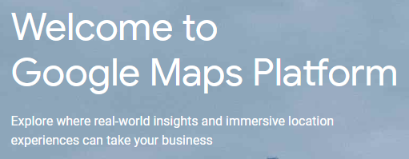
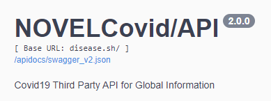

  

#  COV19-MAP
COV19-MAP to aplikacja na urządzenia platformy android, pozwalająca śledzić aktualne statystyki dotyczące COVID-19 bezpośrednio na mapach google.
## Spis treści
* [O projekcie](#o-projekcie)
  * [Technologie](#technologie)
* [Funkcjonalność](#funkcjonalność)
* [Informacje Dodatkowe](#informacje-dodatkowe)
* [Autorzy](#autorzy)

## O projekcie
Projekt został zrealizowany na zaliczenie przedmiotu ,,Cloud Computing w aplikacjach mobilnych dla platformy Android".
### Technologie

  

W naszym projekcie wykorzystujemy trzy technologie:

* Mapy Google
* Autoryzację Firebase
* NovelCovid Api

Nasza aplikacja opiera swoją funkcjonalność o mapy google, dodatkowo wspierana jest przez autoryzaje Firebase. Do pobierania danych o stanie COVID-19, w różnych krajach, wykorzystujemy NovelCovid Api, który dostarcza informacji między innymi o:

* Zarażeniach w danym kraju
* Zgonach
* Przypadkach aktywnych
* Wyleczeniach

Dane pobierane są przy każdym uruchomieniu aplikacji a "w chmurze" aktualizowane są co ok. 5 minut. Dodatkowo w pobieranych danych, znajdują się odnośniki do flag danych państw.

* [O NovelCovid Api](https://corona.lmao.ninja/docs/#/Countries%20/%20Continents) 
* [NovelCovid Api Github](https://github.com/NovelCovid/API) 

Przykładowe dane w formacie JSon

## Funkcjonalność
Funkcjonalność naszej aplikacji polega na lokalizowaniu przez użytkownika państwa, o którym chce uzyskać informacje. Po wybraniu wyświetlane są informacje o:

* Przypadkach
* Stanie osób zarażonych
* Zgonach
* Przypadkach osób wyleczonych

Na mapie pokazywana jest rónież lokalizacja użytkownika.

Użytkownik przed użytkowaniem aplikacji zobowiązany jest do zalogowania się, poprzez jedną z trzech dostępnych metod:

* Email
* Telefon/SMS
* Konto Google

<table style="width:100%">
  <tr>
    <th>
      Logowanie
       
      
    </th>
    <th>
      Wylogowywanie
       
      
    </th>
  </tr>
</table>

## Informacje dodatkowe

O ile same dane o COVID-19 nie stanowią problemu dla aplikacji, o tyle pobieranie wszystkich flag państw jest już obciążające. Z tego powodu falgi wraz z informacjami pojawiają się w aplikacji, po czasie mogącym przekraczać jedną minutę.
Jeżeli chcesz by aplikacja ładowała się szybciej, należy wyłączyć pobieranie flag w zaznoczonym w kodzie miejscu.

## Autorzy

* Mateusz Kusiak
* Michał Koczewski

Grupa S22-32
